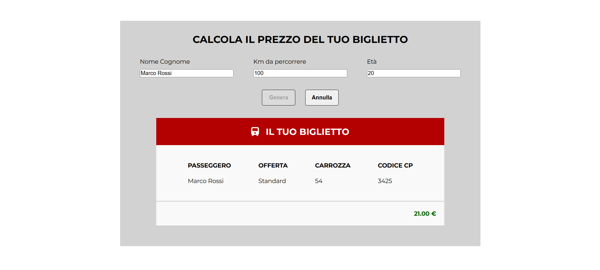

  

<h1 align="center">Calcolo del prezzo del biglietto del treno</h1>

Interfaccia web che calcola il prezzo di un biglietto del treno in base ai chilometri da percorrere e all’età del passeggero, applicando gli sconti previsti e mostrando un riepilogo stile biglietto.

---

## Milestone 1 – Logica di base

- Implementazione della logica di calcolo in JavaScript partendo da input semplici.
- Dati richiesti:
  - chilometri da percorrere;
  - età del passeggero.
- Regole applicate:
  - prezzo base: **0.21 € / km**;
  - **–20%** per i minorenni;
  - **–40%** per gli over 65.
- Il risultato viene verificato tramite `console.log()`.

---

## Milestone 2 – Form e output in pagina

- Creazione di un **form HTML** dove l’utente inserisce:
  - nome e cognome;
  - chilometri da percorrere;
  - età.
- Stampa in pagina del riepilogo del biglietto con:
  - nome passeggero;
  - tipo di offerta (standard / scontata);
  - numero di carrozza;
  - codice CP generato;
  - prezzo finale formattato con **due decimali**.

---

## Milestone 3 – UI e stile

- Restyling dell’interfaccia per avvicinarsi al mockup fornito:
  - layout centrato;
  - card riepilogo del biglietto;
  - evidenza visiva del prezzo finale.
- Piccole ottimizzazioni sulla gestione degli input per rendere il flusso più chiaro all’utente.

---

## Anteprima

---

## Tecnologie utilizzate

- HTML  
- CSS  
- JavaScript
